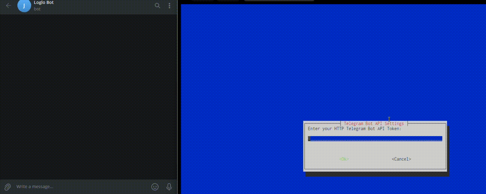

# log-locate (Loglo V2)




A lightweight log watcher for Linux servers. Tails log files and sends Telegram or email alerts when configured patterns are matched — no stack, no containers, just bash and systemd.

---

## Features

- Watches any log file in real time via `tail -F`
- Matches exact words (`ERROR`, `FATAL`) or prefix wildcards (`user_id=*`, `request_id=*`)
- Batches matching lines over a configurable window before sending one grouped alert
- Cooldown period suppresses alert spam after a burst
- One dedicated systemd service per watched file — auto-restarts on crash
- Telegram and/or email (SMTP) notifications
- Named watchers so you never type a full path again

---

## Requirements

- Linux with systemd (Ubuntu 20.04+ / Debian 11+)
- `curl`, `tail`, `awk`, `grep`
- A Telegram bot token + chat ID, or SMTP credentials

---

## Install

```bash
curl -fsSL https://raw.githubusercontent.com/Zay4r/LogLocate/v2/install.sh -o /tmp/install.sh && sudo bash /tmp/install.sh
```

The installer will:

1. Install the daemon and CLI to `/usr/local/bin/`
2. Install the systemd service template
3. Run an interactive wizard to configure your notification channel
4. Create `/etc/log-locate/config` with your settings
5. Add your user to the `systemd-journal` group so `loglo logs` works without sudo

> **Re-login** (or run `newgrp systemd-journal`) after install for journal access to take effect.

---

## Quick Start

```bash
# Start watching a log file
sudo loglo add /var/log/myapp.log --name myapp

# Check status
loglo status

# Tail the watcher's own logs
loglo logs myapp

# Send a test alert to verify your Telegram/email config
loglo test-alert

# Stop watching
sudo loglo remove myapp
```

---

## Commands

| Command                                                    | Requires sudo | Description                                   |
| ---------------------------------------------------------- | ------------- | --------------------------------------------- |
| `loglo add <file> [--name <name>] [--alert "PATTERN ..."]` | yes           | Start watching a file                         |
| `loglo remove <name-or-file>`                              | yes           | Stop watching a file                          |
| `loglo status`                                             | no            | Show all watched files and their state        |
| `loglo list`                                               | no            | List registered name → path mappings          |
| `loglo logs <name-or-file>`                                | no            | Tail the daemon's journald output             |
| `loglo test-alert`                                         | no            | Send a test notification using current config |
| `loglo search <name-or-file> <keyword>`                    | no            | Search indexed lines                          |
| `loglo range <name-or-file> <from-ts> <to-ts>`             | no            | Search lines in a time range                  |
| `loglo help`                                               | no            | Show usage                                    |

---

## Configuration

Global config lives at `/etc/log-locate/config`. Per-file overrides go in `/etc/log-locate/<name>.conf`.

```bash
# /etc/log-locate/config

# Patterns that trigger alerts — space-separated
# Plain words = exact token match:   ERROR FATAL WARN
# Prefix wildcard = key=value match: user_id=* request_id=*
ALERT_PATTERNS="ERROR FATAL WARN"

# Notification channel: telegram | email | both
NOTIFY="telegram"

# Telegram
TELEGRAM_BOT_TOKEN="your_bot_token"
TELEGRAM_CHAT_ID="your_chat_id"

# Email (SMTP)
SMTP_HOST="smtp.gmail.com"
SMTP_PORT="587"
SMTP_USER="you@gmail.com"
SMTP_PASS="your_app_password"
ALERT_FROM="you@gmail.com"
ALERT_TO="alerts@yourteam.com"

# Batch matching lines for this many seconds before sending one alert
BATCH_SECONDS="10"

# Suppress alerts for this many seconds after one fires
COOLDOWN_SECONDS="300"
```

To apply config changes, restart the watcher:

```bash
sudo systemctl restart loglo-<name>.service
```

---

## How Alerts Work

1. A new line appears in the watched file
2. Each token in the line is checked against `ALERT_PATTERNS`
3. On a match, the line is appended to a batch file
4. After `BATCH_SECONDS`, a single grouped alert is sent
5. A `COOLDOWN_SECONDS` window begins — no further alerts during this period
6. After cooldown, the next match triggers a new batch

This means a burst of 100 errors sends **one** alert, not 100.

---

## Per-file Pattern Overrides

Watch a file with different alert patterns than the global config:

```bash
sudo loglo add /var/log/auth.log --name auth --alert "FAILED INVALID"
```

This writes `/etc/log-locate/auth.conf` which overrides `ALERT_PATTERNS` for that watcher only.

---

## Uninstall

```bash
curl -fsSL https://raw.githubusercontent.com/Zay4r/LogLocate/v2/uninstall.sh -o /tmp/uninstall.sh && sudo bash /tmp/uninstall.sh
```

This stops and removes all watchers, binaries, config, and the system user.

---

## File Layout

```
/usr/local/bin/loglo                  — CLI (also installed as log-locate)
/usr/local/bin/log-locate-daemon      — file watcher daemon
/etc/systemd/system/log-locate@.service  — template unit (legacy)
/etc/systemd/system/loglo-<name>.service — per-file unit (created by loglo add)
/etc/log-locate/config                — global config
/etc/log-locate/<name>.conf           — per-file config override
/etc/log-locate/registry              — name → path registry
```

---

## License

MIT
